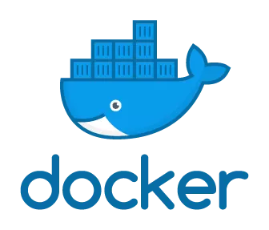

## Azure pipeline + Docker + AWS CloudFront + Jekyll
{:width="250px"}
{:width="150px"}
{:width="300px"}
 
{:width="200px"}

This is demonstration of Azure pipeline implementation using static website which will execute whole build process and deploy it on AWS CloudFront. We have used Azure pipeline, Docker, github, Jekyll, AWS CloudFront and s3_website to experience this automation.

#### Source Code
[https://github.com/tarunjangra/azure-pipeline](https://github.com/tarunjangra/azure-pipeline)

#### Public Pipeline
[https://dev.azure.com/tarunjangra/Azure pipeline/_build](https://dev.azure.com/tarunjangra/Azure pipeline/_build)
